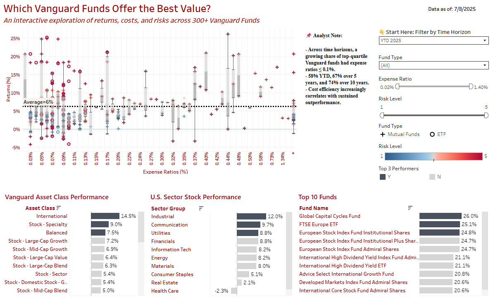

# vanguard-fund-analyzer
This project scrapes, processes, and visualizes Vanguard mutual fund and ETF data to identify cost-efficient funds that deliver strong long-term performance.

## 🔍 Project Goals

- Collect fund-level data from Vanguard’s official website using Python
- Compare fund performance across timeframes (YTD, 5Y, 10Y, Since Inception)
- Enable interactive filtering by fund type, risk level, and return period
- Highlight correlation between **low expense ratios** and **top-quartile returns**

---

## 🚀 Features

- ✅ Web scraping from Vanguard’s ETF & Mutual Fund listings  
- ✅ Structured data export (`.csv`) for easy dashboard use  
- ✅ Clean separation of fund types and investment metrics  
- ✅ Tableau Public dashboard for interactive exploration  
- ✅ Modern workflow using Google Colab + GitHub


## 📁 Files in This Repo

| File                             | Description                                       |
|----------------------------------|-------------------------------------------------- |
| `vanguard_fund_scraper.ipynb`    | Google Colab notebook with scraping logic         |
| `data/vanguard_etfs.csv`         | Cleaned ETF data (automatically generated)        |
| `data/vanguard_mutual_funds.csv` | Cleaned Mutual Fund data (automatically generated)|
| `README.md`                      | Project overview and documentation                |
| `LICENSE`                        | MIT License for reuse and sharing                 |

> **Note:** CSV files in `/data` are provided as examples only. You can regenerate them by running the notebook.
**Sample CSV columns include:**
`Symbol`, `Fund Name`, `Expense Ratio`, `Risk Level`, `Return (Since Inception)`, `YTD Return`, `5Y Return`, `10Y Return`

## 📊 Data Source

All fund performance, expense ratio, and risk data was scraped from [Vanguard’s Investment Product Listings](https://investor.vanguard.com/investment-products/list/all?filters=open) as of the scrape date. The page includes all currently listed ETFs and Mutual Funds by Vanguard.
> The cleaned ETF and Mutual Fund datasets are saved to the `/data` folder.
> 
> **Disclaimer:** This project is for educational purposes only and does not constitute financial advice. Data accuracy depends on the structure of Vanguard’s website at the time of scraping.


## 📓 Notebook

The data scraper (`vanguard_fund_scraper.ipynb`) collects the following from Vanguard's public site:
- Fund names, Symbol, Categories
- Annualized returns across multiple periods (YTD, 5 year, 10 year, Since Inception)
- Expense ratios
- Risk levels

> The HTML structure was manually explored via browser inspection to locate and extract deeply nested table headers and data cells across ETF and Mutual Fund pages.
> The data is output as a `.csv` file for use in Tableau or other analysis tools.
➡️ [View Notebook on GitHub](./vanguard_fund_scraper.ipynb)


## 📊 Tableau Dashboard

Interactive dashboard analyzing “best bang for buck” across fund types.
🔗 **[View the interactive dashboard on Tableau Public →](https://public.tableau.com/app/profile/nian.liu6717/viz/Vanguard_Funds_Best_Bang_Buck_Interactive_Analysis/VanguardUniverse)**  
> Filter by fund type, risk level, or time horizon to find funds that match your investment goals.
> Key Insight: "Across time horizons, a growing share of top-quartile Vanguard funds had expense ratios ≤ 0.1% — 59% YTD, 68% over 5 years, and 75% over 10 years. Cost efficiency increasingly correlates with sustained outperformance."





---

## 🧪 Getting Started

1. Open `vanguard_fund_scraper.ipynb` in Google Colab
2. Run all cells to generate fresh data
3. (Optional) Use the sample CSVs in the `/data` folder, or generate fresh ones by running the notebook
4. Load them into Tableau for interactive analysis


## 💻 How to Run Locally

1. Clone this repository
2. Install dependencies:
   ```bash
   pip install requests beautifulsoup4 pandas
4. Run the notebook:
   Jupyter notebook vanguard_fund_scraper.ipynb

## 📄 License

This project is licensed under the MIT License. See the [LICENSE](./LICENSE) file for details.

