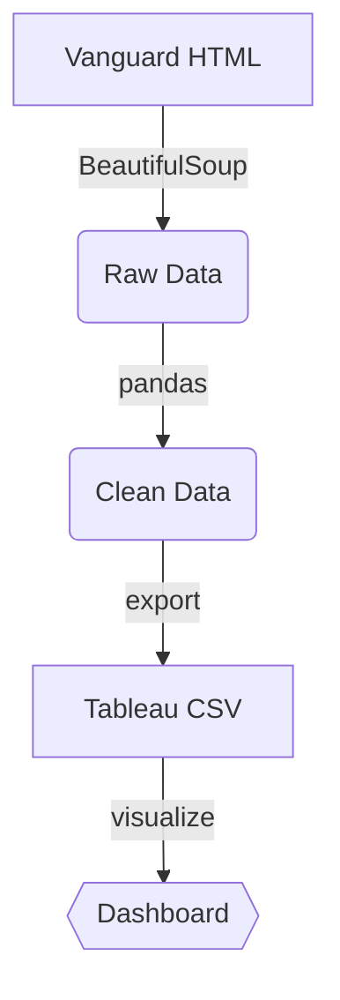

# 🏦vanguard-fund-analyzer

>     <br>
>This project scrapes, processes, and visualizes Vanguard mutual fund and ETF data to identify cost-efficient funds that deliver strong long-term performance.

## 🔍 Project Goals

1. **Web Scraping Automation**
   - Extract ETF and Mutual Fund data from [Vanguard's official listings](https://investor.vanguard.com/investment-products/list/all?filters=open)
   - Built with Python (requests + BeautifulSoup)

2. **Data Processing**
   - Clean and normalize scraped data
   - Prepare Tableau-ready datasets

3. **Interactive Exploration**
   - Enable filtering by fund type, risk level, and return period
   - Tableau dashboard for visual analysis

4. ** Performance Analysis and Insights**
   - Compare funds across multiple timeframes (YTD, 5Y, 10Y, Since Inception)
   - Identify correlation between low expense ratios (≤0.1%) and top-quartile returns


## 🚀 Features

| Feature            | Description                             | Technology            |
|--------------------|---------------------------------------- |---------------------- |
| 🔍 Web Scraping   | Automated data collection from Vanguard | Python, BeautifulSoup  | 
| 🧹 Data Cleaning  | Structured, analysis-ready datasets	   | Pandas                |
| 📊 Visualization  | Interactive Tableau dashboard	         | Tableau Public        |
| 🔄 Workflow       | Reproducibleanalysis pipeline            | Google Colab + GitHub | 

  
---

## 📁 Files in This Repo

| File                             | Description                                       |
|----------------------------------|-------------------------------------------------- |
| `vanguard_fund_scraper.ipynb`    | Google Colab notebook with scraping logic         |
| `data/vanguard_etfs.csv`         | Cleaned ETF data (automatically generated)        |
| `data/vanguard_mutual_funds.csv` | Cleaned Mutual Fund data (automatically generated)|
| `README.md`                      | Project overview and documentation                |
| `LICENSE`                        | MIT License for reuse and sharing                 |

> **Note:** CSV files in `/data` are provided as examples only. You can regenerate them by running the notebook.
> 
> **Sample CSV columns include:**
> `Symbol`, `Fund Name`, `Expense Ratio`, `Risk Level`, `Return (Since Inception)`, `YTD Return`, `5Y Return`, `10Y Return`


## 📊 Data Pipeline



## 📓 Notebook

The data scraper (`vanguard_fund_scraper.ipynb`) collects the following from Vanguard's public site:
- Fund names, Symbol, Categories
- Annualized returns across multiple periods (YTD, 5 year, 10 year, Since Inception)
- Expense ratios
- Risk levels

> The HTML structure was manually explored via browser inspection to locate and extract deeply nested table headers and data cells across ETF and Mutual Fund pages.
> 
> The data is output as a `.csv` file for use in Tableau or other analysis tools.
> 
> ➡️ [View Notebook on GitHub](./vanguard_fund_scraper.ipynb)


## 📊 Tableau Dashboard

Interactive dashboard analyzing “best bang for buck” across fund types.
🔗 **[View the interactive dashboard on Tableau Public →](https://public.tableau.com/app/profile/nian.liu6717/viz/Vanguard_Funds_Best_Bang_Buck_Interactive_Analysis/VanguardUniverse)**  
> Filter by fund type, risk level, or time horizon to find funds that match your investment goals.
>
> **Key Insight:** <br>
> 75% of top-quartile funds over 10 years had expense ratios ≤0.1%. <br>
> Cost efficiency strongly correlates with sustained outperformance. <br>
> Filter by fund type, risk level, or time horizon to match your investment preference. <br>


---

## 🧪 Getting Started

1. Open `vanguard_fund_scraper.ipynb` in Google Colab
2. Run all cells to generate fresh data
3. (Optional) Use the sample CSVs in the `/data` folder, or generate fresh ones by running the notebook
4. Load them into Tableau for interactive analysis


## 💻 How to Run Locally

1. Clone this repository
2. Install dependencies:
   ```bash
   pip install requests beautifulsoup4 pandas
   ```
4. Run the notebook:
   ```
   vanguard_fund_scraper.ipynb
   ```
   
## ⚠️ **Disclaimer:** 
This project for educational purpose only. Data accuracy depends on Vanguard's website structure at scrape time. Not financial advice.

## 📄 License

This project is licensed under the MIT License. See the [LICENSE](./LICENSE) file for details. <br>
Copyright (c) 2025 Nian Liu

## 🏷️ Tags
#python #webscraping #beautifulsoup #pandas #tableau #dataanalytics
